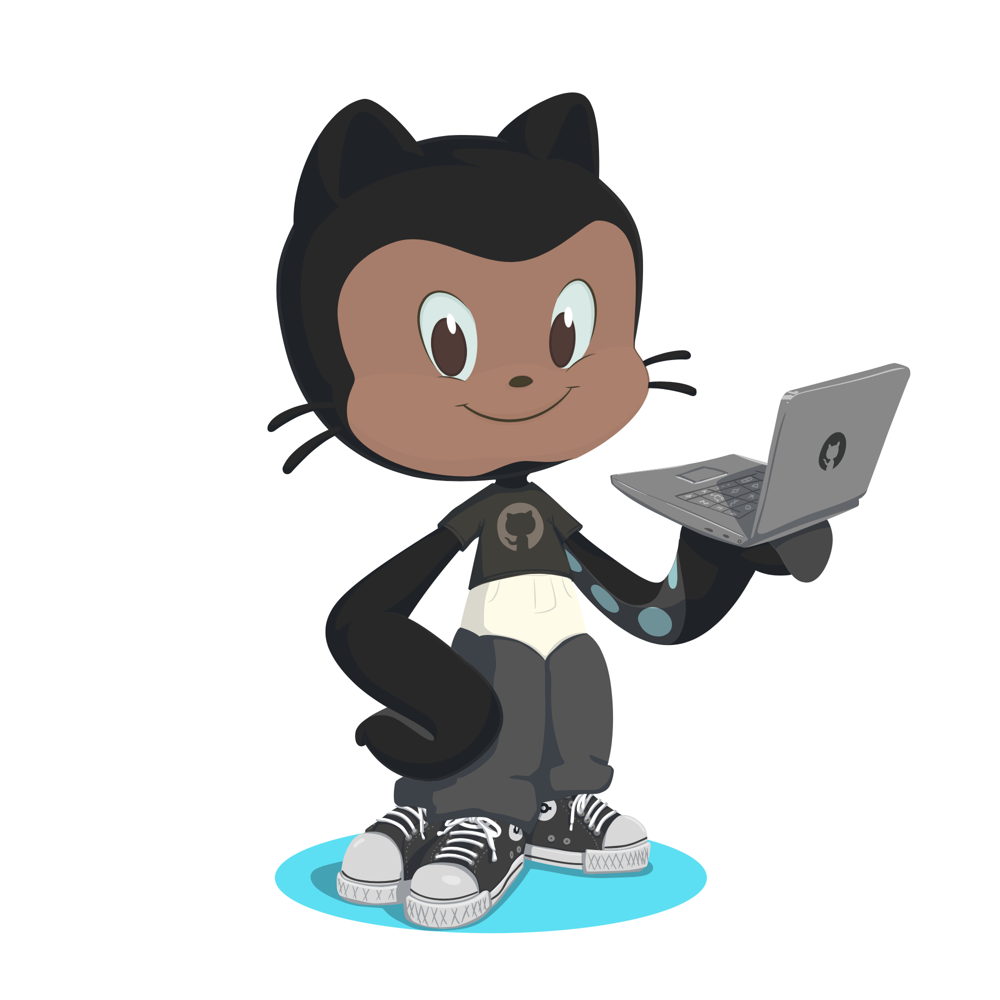

 

<h1>Hi    I'm Antonio Pantaleo</h1>

## 📆 Joke of the day <!-- script:start TODAY --> (02/10/2022) <!-- script:end TODAY -->

<!-- script:start JOKE -->
**What's the object-oriented way to become wealthy?**

*Inheritance.*
<!-- script:end JOKE -->

## 🏆 My Latest Projects

## 🌟 Contributed to

- [ndp/git-cheatsheet](https://github.com/ndp/git-cheatsheet) - Italian Translation

## 🧑🏽‍💻 About 

🏡  <!-- script:start AGE --> 26 <!-- script:end AGE --> years old developer based in Turin, Italy

🎓  I've a master degree in computer engineering

📱  In my daily life I mainly work as a native iOS developer, but I love learning new things and challenge myself with different technologies

🛣  On the road to be an expert iOS engineer and a proficient full stack developer

🍺  When I'm not coding, I like to make music, run or go out with friends and take a cold beer

  
<h2>🎯 Skills (tap to expand)</h2>

  
  #### Programming Languages

  [![Swift]][link-swift] [![Java]][link-java] [![Python]][link-python] [![Dart]][link-dart] [![typescript]][link-typescript] [![javascript]][link-javascript] [![bash]][link-bash]

  #### Frontend

  [![html]][link-html] [![css]][link-css]

  #### Backend

  [![nodejs]][link-nodejs] [![express]][link-express] [![GraphQL]][link-graphql] [![Flask]][link-flask] [![Django]][link-django]

  #### Databases

  [![SQLite]][link-sqlite] [![MySQL]][link-mysql] [![Postgresql]][link-postgres]

  #### Backend As A Service (BaaS)

  [![Firebase]][link-firebase] [![Heroku]][link-heroku]

  #### Frameworks

  [![mocha]][link-mocha] [![chai]][link-chai] [![selenium]][link-selenium] [![Flutter]][link-flutter] [![TelegramBotApi]][link-telegrambotapi] [![Cocoapods]][link-cocoapods] [![FFMPEG]][link-ffmpeg] [![socketio]][link-socketio] [![apollo]][link-apollo] [![prisma]][link-prisma]

  #### CMS 

  [![Strapi]][link-strapi]
  
  #### Static Website Generators
  
  [![Hugo]][link-hugo]
  
  #### CICD
  [![Docker]][link-docker]

  #### IDEs

  [![Xcode]][link-xcode] [![vscode]][link-vscode] [![netbeans]][link-netbeans]

  #### Text Editors

  [![sublime]][link-sublime] [![Vim]][link-vim] [![atom]][link-atom]

  #### Softwares

  [![postman]][link-postman] [![sketch]][link-sketch]

  #### DVCS

  [![Git]][link-git] [![github]][link-github] [![gitlab]][link-gitlab]

## 📈 Stats

<a href="https://github.com/anuraghazra/github-readme-stats" target="_blank" rel="noopener noreferrer">

<a/>
  

<a href="https://github.com/anuraghazra/github-readme-stats" target="_blank" rel="noopener noreferrer">

<a/>

 
  
## 🔍 Find me

<!-- [![website]][my-website] -->
[![linkedin]][my-linkedin] [![spotify]][my-spotify] [![bandcamp]][my-bandcamp]

<!-- -------------------------------------------------------------------------------------------------------------- -->

<!-------- LINKS -------->

[my-website]: https://antoniopantaleo.github.io
[doug_devs]: https://github.com/doug-devs
[myoctocat]: https://myoctocat.com
[my-linkedin]: https://www.linkedin.com/in/antonio-pantaleo-6579b9180/
[my-bandcamp]: https://realcapecodd.bandcamp.com
[my-spotify]: https://open.spotify.com/album/3JfEDDdz9toGJe9KWnm8e8
[link-swift]: https://swift.org
[link-xcode]: https://developer.apple.com/xcode/
[link-cocoapods]: https://cocoapods.org/about
[link-java]: https://www.java.com/it/
[link-python]: https://www.python.org
[link-mysql]: https://www.mysql.com/it/
[link-firebase]: https://firebase.google.com/use-cases
[link-postgres]: https://www.postgresql.org
[link-flask]: https://flask.palletsprojects.com
[link-django]: https://www.djangoproject.com
[link-heroku]: https://www.heroku.com
[link-ffmpeg]: https://ffmpeg.org/
[link-dart]: https://dart.dev
[link-flutter]: https://flutter.dev
[link-git]: https://git-scm.com
[link-telegrambotapi]: https://core.telegram.org/bots/api
[link-vim]: http://www.vim.org
[link-sqlite]: https://sqlite.org/index.html
[link-strapi]: https://strapi.io
[link-graphql]: https://graphql.org
[link-css]: https://developer.mozilla.org/en-US/docs/Web/CSS
[link-html]: https://developer.mozilla.org/en-US/docs/Web/HTML
[link-javascript]: https://www.javascript.com
[link-typescript]: https://www.typescriptlang.org
[link-nodejs]: https://nodejs.org
[link-express]: http://expressjs.com
[link-vscode]: https://code.visualstudio.com
[link-mocha]: https://mochajs.org
[link-selenium]: https://www.selenium.dev
[link-atom]: https://atom.io
[link-sublime]: https://www.sublimetext.com
[link-socketio]: https://socket.io
[link-gitlab]: https://about.gitlab.com
[link-github]: https://github.com
[link-netbeans]: https://netbeans.apache.org/
[link-apollo]: https://www.apollographql.com
[link-chai]: https://www.chaijs.com
[link-postman]: https://www.postman.com
[link-prisma]: https://www.prisma.io  
[link-sketch]: https://www.sketch.com
[link-hugo]: https://gohugo.io
[link-docker]: https://www.docker.com
[link-bash]: https://www.gnu.org/software/bash

<!-- UNUSED
[link-colab]: https://colab.research.google.com/notebooks/intro.ipynb
[link-homebrew]: https://brew.sh
[link-latex]: https://www.latex-project.org/get/
[link-pihole]: https://pi-hole.net

[link-medium]: 	https://medium.com/@antonio_pantaleo
-->

  
<!-------- LOGOS -------->

[linkedin]: https://img.shields.io/badge/-linkedin-0A66C2?style=for-the-badge&logo=linkedin
[netbeans]: https://img.shields.io/badge/-netbeans-blue?style=for-the-badge&logo=apache%20netbeans%20ide&logoColor=white
[apollo]: https://img.shields.io/badge/-apollo-311C87?style=for-the-badge&logo=apollo%20graphql&logoColor=white
[chai]: https://img.shields.io/badge/-chai-A30701?style=for-the-badge&logo=chai&logoColor=white
[postman]: https://img.shields.io/badge/-postman-FF6C37?style=for-the-badge&logo=postman&logoColor=white
[prisma]: https://img.shields.io/badge/-prisma-2D3748?style=for-the-badge&logo=prisma&logoColor=white
[sketch]: https://img.shields.io/badge/-sketch-e0a504?style=for-the-badge&logo=sketch&logoColor=white
[hugo]:  https://shields.io/badge/-hugo-EB5188?style=for-the-badge&logo=hugo&logoColor=white
[docker]: https://shields.io/badge/-docker-2496ED?style=for-the-badge&logo=docker&logoColor=white
[bash]: https://shields.io/badge/-bash-gray?style=for-the-badge&logo=gnu-bash&logoColor=white

<!-- UNUSED
[colab]: https://img.shields.io/badge/-colab-F9AB00?style=for-the-badge&logo=google%20colab&logoColor=white
[homebrew]: https://img.shields.io/badge/-homebrew-e09431?style=for-the-badge&logo=homebrew&logoColor=white
[latex]: https://img.shields.io/badge/-latex-008080?style=for-the-badge&logo=latex&logoColor=white
[pihole]: https://img.shields.io/badge/-pihole-96060C?style=for-the-badge&logo=pihole&logoColor=white

[medium]: https://img.shields.io/badge/-medium-black?style=for-the-badge&logo=medium
-->

[github]: https://img.shields.io/badge/-github-black?style=for-the-badge&logo=github&logoColor=white
[gitlab]: https://img.shields.io/badge/-gitlab-white?style=for-the-badge&logo=gitlab&logoColor=white
[android-studio]: https://img.shields.io/badge/-android%20studio-44A833?style=for-the-badge&logoColor=white&logo=androidstudio
[socketio]: https://img.shields.io/badge/-socket.io-010101?style=for-the-badge&logoColor=white&logo=socketdotio
[sublime]: https://img.shields.io/badge/-sublime%20text-404040?style=for-the-badge&logoColor=white&logo=sublimetext
[atom]: https://img.shields.io/badge/-atom-363538?style=for-the-badge&logoColor=white&logo=atom
[selenium]: https://img.shields.io/badge/-selenium-66B045?style=for-the-badge&logo=selenium&logoColor=white
[swift]: https://img.shields.io/badge/-swift-FA7343?style=for-the-badge&logo=swift&logoColor=white
[mocha]: https://img.shields.io/badge/-mocha-87694D?style=for-the-badge&logo=mocha&logoColor=white
[vscode]: https://img.shields.io/badge/-vscode-blue?style=for-the-badge&logo=visualstudiocode&logoColor=white
[express]: https://img.shields.io/badge/-express-9AC355?style=for-the-badge&logo=express&logoColor=white
[nodejs]: https://img.shields.io/badge/-node.js-2E6B1C?style=for-the-badge&logo=nodedotjs&logoColor=white
[typescript]: https://img.shields.io/badge/-typescript-blue?style=for-the-badge&logo=typescript&logoColor=white
[xcode]: https://img.shields.io/badge/-xcode-147EFB?style=for-the-badge&logo=xcode&logoColor=white
[html]: https://img.shields.io/badge/-html-orange?style=for-the-badge&logo=html5&logoColor=white
[javascript]: https://img.shields.io/badge/-javascript-yellow?style=for-the-badge&logo=javascript&logoColor=white
[css]: https://img.shields.io/badge/-css-blue?style=for-the-badge&logo=css3
[java]: https://img.shields.io/badge/-java-ED8B00?style=for-the-badge&logo=java&logoColor=white
[python]: https://img.shields.io/badge/-python-brightgreen?style=for-the-badge&logo=python&logoColor=white
[mysql]: https://img.shields.io/badge/-mysql-4479A1?style=for-the-badge&logo=mysql&logoColor=white
[firebase]: https://img.shields.io/badge/-firebase-yellow?style=for-the-badge&logo=firebase&logoColor=white
[postgresql]: https://img.shields.io/badge/-postgres-4169E1?style=for-the-badge&logo=postgresql&logoColor=white
[flask]: https://img.shields.io/badge/-flask-1B8D63?style=for-the-badge&logo=flask&logoColor=white
[django]: https://img.shields.io/badge/-django-146849?style=for-the-badge&logo=django&logoColor=white
[tensorflow]: https://img.shields.io/badge/-tensorflow-FF6F00?style=for-the-badge&logo=tensorflow&logoColor=white
[heroku]: https://img.shields.io/badge/-heroku-430098?style=for-the-badge&logo=heroku&logoColor=white
[flutter]: https://img.shields.io/badge/-flutter-blue?style=for-the-badge&logo=flutter&logoColor=white
[git]: https://img.shields.io/badge/-git-orange?style=for-the-badge&logo=git&logoColor=white
[telegrambotapi]: https://img.shields.io/badge/-telegram%20bot%20api-blue?style=for-the-badge&logo=telegram&logoColor=white
[cocoapods]: https://img.shields.io/badge/-cocoapods-EE3322?style=for-the-badge&logo=cocoapods&logoColor=white
[dart]: https://img.shields.io/badge/-dart-0175C2?style=for-the-badge&logo=dart&logoColor=white
[ffmpeg]: https://img.shields.io/badge/-ffmpeg-007808?style=for-the-badge&logo=ffmpeg&logoColor=white
[keras]: https://img.shields.io/badge/-keras-D00000?style=for-the-badge&logo=keras&logoColor=white
[vim]: https://img.shields.io/badge/-vim-019733?style=for-the-badge&logo=vim&logoColor=white
[sqlite]: https://img.shields.io/badge/-sqlite-003B57?style=for-the-badge&logo=sqlite&logoColor=white
[strapi]: https://img.shields.io/badge/-strapi-2F2E8B?style=for-the-badge&logo=strapi&logoColor=white
[instagram]: https://img.shields.io/badge/instagram-E4405F?style=for-the-badge&logo=instagram&logoColor=white
[graphql]: https://img.shields.io/badge/-graphql-D249A6?logo=graphql&style=for-the-badge&logoColor=white
[bandcamp]: https://img.shields.io/badge/bandcamp-408294?style=for-the-badge&logo=data:image/svg+xml;base64,PD94bWwgdmVyc2lvbj0iMS4wIiBlbmNvZGluZz0iVVRGLTgiPz4KPHN2ZyB3aWR0aD0iNjMxcHgiIGhlaWdodD0iNjMxcHgiIHZpZXdCb3g9IjAgMCA2MzEgNjMxIiB2ZXJzaW9uPSIxLjEiIHhtbG5zPSJodHRwOi8vd3d3LnczLm9yZy8yMDAwL3N2ZyIgeG1sbnM6eGxpbms9Imh0dHA6Ly93d3cudzMub3JnLzE5OTkveGxpbmsiPgogICAgPCEtLSBHZW5lcmF0b3I6IFNrZXRjaCA1Mi40ICg2NzM3OCkgLSBodHRwOi8vd3d3LmJvaGVtaWFuY29kaW5nLmNvbS9za2V0Y2ggLS0+CiAgICA8dGl0bGU+QXJ0Ym9hcmQ8L3RpdGxlPgogICAgPGRlc2M+Q3JlYXRlZCB3aXRoIFNrZXRjaC48L2Rlc2M+CiAgICA8ZyBpZD0iQXJ0Ym9hcmQiIHN0cm9rZT0ibm9uZSIgc3Ryb2tlLXdpZHRoPSIxIiBmaWxsPSJub25lIiBmaWxsLXJ1bGU9ImV2ZW5vZGQiPgogICAgICAgIDxnIGlkPSJiYW5kY2FtcCIgdHJhbnNmb3JtPSJ0cmFuc2xhdGUoMC4wMDAwMDAsIDEzOC4wMDAwMDApIiBmaWxsPSIjRkZGRkZGIj4KICAgICAgICAgICAgPHBvbHlnb24gaWQ9IlBhdGgiIHBvaW50cz0iMCAzNTYgMTk1LjUzMTEyNSAwIDYzMSAwIDQzNS40NDI1ODMgMzU2Ij48L3BvbHlnb24+CiAgICAgICAgPC9nPgogICAgPC9nPgo8L3N2Zz4=
[spotify]: https://img.shields.io/badge/Spotify-1ED760?&style=for-the-badge&logo=spotify&logoColor=white
[website]: https://img.shields.io/badge/portfolio-2C2D30?style=for-the-badge&logo=data:image/svg+xml;base64,PD94bWwgdmVyc2lvbj0iMS4wIiBlbmNvZGluZz0iVVRGLTgiPz4KPHN2ZyB3aWR0aD0iNjMxcHgiIGhlaWdodD0iNjMxcHgiIHZpZXdCb3g9IjAgMCA2MzEgNjMxIiB2ZXJzaW9uPSIxLjEiIHhtbG5zPSJodHRwOi8vd3d3LnczLm9yZy8yMDAwL3N2ZyIgeG1sbnM6eGxpbms9Imh0dHA6Ly93d3cudzMub3JnLzE5OTkveGxpbmsiPgogICAgPCEtLSBHZW5lcmF0b3I6IFNrZXRjaCA1Mi40ICg2NzM3OCkgLSBodHRwOi8vd3d3LmJvaGVtaWFuY29kaW5nLmNvbS9za2V0Y2ggLS0+CiAgICA8dGl0bGU+QXJ0Ym9hcmQ8L3RpdGxlPgogICAgPGRlc2M+Q3JlYXRlZCB3aXRoIFNrZXRjaC48L2Rlc2M+CiAgICA8ZyBpZD0iQXJ0Ym9hcmQiIHN0cm9rZT0ibm9uZSIgc3Ryb2tlLXdpZHRoPSIxIiBmaWxsPSJub25lIiBmaWxsLXJ1bGU9ImV2ZW5vZGQiPgogICAgICAgIDxnIGlkPSJwcm92aWRlcl9pbnRlcm5ldHN2ZyIgdHJhbnNmb3JtPSJ0cmFuc2xhdGUoNTEuMDAwMDAwLCA1Ni4wMDAwMDApIiBzdHJva2U9IiNGRkZGRkYiPgogICAgICAgICAgICA8ZyBpZD0iZzM4ODUiPgogICAgICAgICAgICAgICAgPHBhdGggZD0iTTUzMS4wNzY5NzgsMjU5LjQzNDAzNiBDNTMxLjA3Njk3OCw0MDIuMzM1MTUgNDEyLjMzNjM0OCw1MTguMTg4NTQ0IDI2NS44NDk3MjksNTE4LjE4ODU0NCBDMTE5LjM3NTgyNiw1MTguMTg4NTQ0IDAuNjIyNDgwNjYxLDQwMi4zNDI2OTcgMC42MjI0ODA2NjEsMjU5LjQzNDAzNiBDMC42MjI0ODA2NjEsMTE2LjUzMjkyMyAxMTkuMzYzMTEsMC42Nzk1MjkwNjMgMjY1Ljg0OTcyOSwwLjY3OTUyOTA2MyBDNDEyLjMyMzYzMiwwLjY3OTUyOTA2MyA1MzEuMDc2OTc4LDExNi41MjUzNzYgNTMxLjA3Njk3OCwyNTkuNDM0MDM2IFoiIGlkPSJwYXRoMjgxNiIgc3Ryb2tlLXdpZHRoPSIxNC4wMDA2MDgiIHN0cm9rZS1saW5lY2FwPSJyb3VuZCI+PC9wYXRoPgogICAgICAgICAgICAgICAgPHBhdGggZD0iTTM4LjM5ODUzODQsMTI1Ljc0NjA0MiBMNDkwLjk2NDAxMiwxMjUuNzQ2MDQyIiBpZD0icGF0aDM1OTIiIHN0cm9rZS13aWR0aD0iMTQiPjwvcGF0aD4KICAgICAgICAgICAgICAgIDxwYXRoIGQ9Ik0zOC43OTgzODM4LDM4Ny40OTA5MzIgTDQ5NC42OTU1MzYsMzg3LjQ5MDkzMiIgaWQ9InBhdGgzNTkyLTIiIHN0cm9rZS13aWR0aD0iMTQiPjwvcGF0aD4KICAgICAgICAgICAgICAgIDxwYXRoIGQ9Ik0zLjU2NTc3MDgxLDI1OC42NTI3NzQgTDUyNy43NDI4OTksMjU4LjY1Mjc3NCIgaWQ9InBhdGgzNTkyLTItNSIgc3Ryb2tlLXdpZHRoPSIxNCI+PC9wYXRoPgogICAgICAgICAgICAgICAgPHBhdGggZD0iTTI2MS4yNjY2MzMsNTE1LjMzMjM5OCBMMjYxLjI2NjYzMyw4LjQzNTUwODg4IiBpZD0icGF0aDM1OTItNC00LTMiIHN0cm9rZS13aWR0aD0iMTQiPjwvcGF0aD4KICAgICAgICAgICAgICAgIDxwYXRoIGQ9Ik0yNjEuMjY2NjMzLDUwNy41MTM4NDggQzk4LjMwMzU2OSw0NTEuMjMxOTE2IDcxLjI1NTc1NzYsOTguNjIyMjE5NiAyNjEuMjY2NjMzLDguNDM1NTA4ODgiIGlkPSJwYXRoMzU5Mi00LTQtMy0wIiBzdHJva2Utd2lkdGg9IjE0Ij48L3BhdGg+CiAgICAgICAgICAgICAgICA8cGF0aCBkPSJNMjYxLjI2NjYzMyw1MDcuNTEzODQ4IEM0NDkuOTI1MTE4LDQyNC4xMDgwOTMgNDQ5LjkyNTExOCw5OC42MjIyMTk2IDI2MS4yNjY2MzMsOC40MzU1MDg4OCIgaWQ9InBhdGgzNTkyLTQtNC0zLTgiIHN0cm9rZS13aWR0aD0iMTQiPjwvcGF0aD4KICAgICAgICAgICAgPC9nPgogICAgICAgIDwvZz4KICAgIDwvZz4KPC9zdmc+
